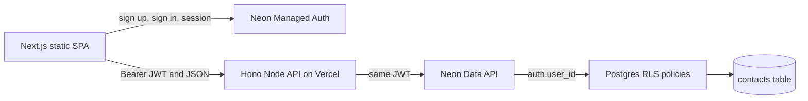

# Architecture and request flow

The repository contains two independently deployed applications.

1. Vercel serves prebuilt HTML, CSS, and JavaScript from `apps/web/out`. There is no Next.js request-time server.
2. The browser authenticates directly with Neon Managed Auth through `@neondatabase/neon-js` and `BetterAuthReactAdapter`.
3. The browser sends the JWT to the separate Hono service as a bearer token.
4. The Hono service validates input and creates a request-scoped Neon Data API client. It never accepts `user_id`.
5. The Data API validates the JWT and exposes the subject through `auth.user_id()`.
6. Postgres grants and row-level security determine which rows can be read or changed.

The API performs validation and gives the browser a stable JSON contract. RLS remains the final ownership boundary even if an API handler is called with another user's contact id.

